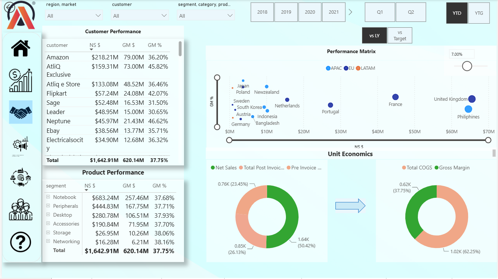

# Business-Insight-360
End-to-end Power BI analytics project featuring data modeling, DAX, interactive dashboards, and data integration from MySQL, Excel, and CSV files.

This project is a comprehensive Power BI dashboard developed to analyze and visualize key performance metrics across various departments at AtliQ Hardware. It provides actionable insights into finance, sales, marketing, supply chain, and executive operations, empowering stakeholders to make informed decisions for strategic growth.

# Features
-Finance View: Explore P&L statements, product analysis, and net sales trends.  

-Sales View: Dive into customer and product performance with dynamic charts and filters.  

-Marketing View: Gain insights into product and regional performance metrics.  

-Supply Chain View: Analyze forecast accuracy and net error metrics.  

-Executive View: Get high-level insights with KPI cards and revenue breakdowns.  

# Data Sources
The dashboard gathers data from two primary sources:

• -Excel/CSV Files: Targets and Market Share data, along with related information, are collected from Excel and CSV files.

• -MySQL Database: Essential facts and dimensions for all departments are pulled from a MySQL database.

# Skills Learned
-Power BI data modeling

-DAX calculations

-Compelling visualization techniques

-Data interpretation

-Dashboard design principles

-User-centric design

-Stakeholder communication ,File size optimization using DAX Studio

-Data integration from various sources like Excel/CSV files, MySQL database, etc.

